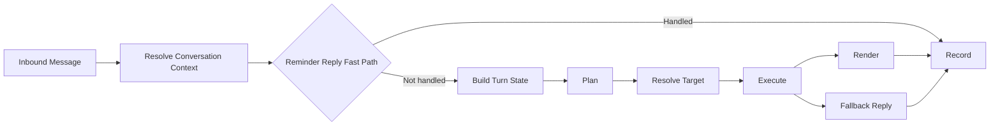

# CognitiveOS 架构说明

## 总览

CognitiveOS 当前保持 **模块化单体** 形态，遵循以下依赖方向：

```text
api -> application -> domain
application -> infrastructure (通过协议 / 实现边界)
```

核心目标不是“做一个大而全的 agent 平台”，而是先把用户请求稳定地转成 **可持久化、可追踪、可暂停、可恢复** 的工作流与记录。

## 当前核心链路

第一阶段主链路聚焦在 assistant conversation kernel：



其中：

- `Resolve Conversation Context`：只负责 `conversation_id / session_id` 绑定与解析。
- `Reminder Reply Fast Path`：保留 reminder continuation 的优先链路，避免影响已稳定的 Temporal 续执行闭环。
- `Build Turn State`：构建当前回合的执行态，不承载长期记忆。
- `Plan`：把用户输入归一成 `AssistantActionPlan`。
- `Resolve Target`：处理“这个 / 那个 / 第二个 / 买药那个”这类对象引用。
- `Execute`：把计划落到 application service，不直接在这里重写业务规则。
- `Render`：统一生成对用户友好的自然回复。
- `Record`：继续写入消息审计，并附带结构化 turn state，供下一回合复用。

## Assistant Execution Kernel

`app/application/conversations/kernel/` 是当前会话执行内核：

- `state.py`
  - `AssistantTurnContext`
  - `AssistantTurnContextBuilder`
  - 聚合最近消息、overview working set、上一回合结构化状态
- `planner.py`
  - 规则快路径
  - 复用现有 `LLMFirstConversationIntentClassifier`
  - 输出统一 `AssistantActionPlan`
- `resolver.py`
  - 解析焦点对象、可见候选、顺序引用与关键词提示
- `executor.py`
  - 统一调用 reminder / task / memory / overview application service
  - 返回结构化执行结果，而不是直接拼回复
- `renderer.py`
  - 统一用户回复风格：先结果，再关键信息，再下一步抓手

## 当前边界约束

- conversation binding 仍放在 `app/infrastructure/conversations/resolver.py`。
- “这个 / 那个 / 第二个” 这类对象级解析 **只放 application kernel**，不继续往 infrastructure 下沉。
- reminder workflow、LLM gateway、messaging adapter 维持既有设计，本轮不扩到新的基础设施抽象。
- `assistant_turn_states` 已作为 infrastructure-level persistence 引入，用来持久化 conversation execution state；消息审计中的 `assistant_turn_state` 继续作为审计快照保留。

## 持久化执行态

assistant kernel 现在会把以下状态写入 `assistant_turn_states`：

- `focused_object_type` / `focused_object_id`
- `dialogue_mode`
- `last_action_type` / `last_action_success`
- `visible_candidates_json`
- `pending_confirmation_json`
- `state_json`

读取顺序为：

1. `assistant_turn_states`
2. 最近消息审计中的 `assistant_turn_state`
3. 当前会话 working set（overview + failed reminders）

## 当前支持的主动作

- 查询类
  - `show_overview`
  - `show_activity`
  - `list_tasks`
  - `list_reminders`
  - `list_memories`
- 创建类
  - `create_task`
  - `create_reminder`
  - `create_memory`
- 修改类
  - `complete_task`
  - `cancel_task`
  - `cancel_reminder`
  - `reschedule_reminder`
  - `retry_failed_reminder`
  - `archive_memory`
- 转换类
  - `convert_task_to_reminder`
  - `convert_reminder_to_task`

## 当前明确不做

- 不引入 `assistant_turn_states` 表
- 不做 task/reminder 双向转换
- 不做 memory schema 扩展
- 不动 Temporal / LLM / Messaging 基础接入层
- 不新增 conversation debug route
